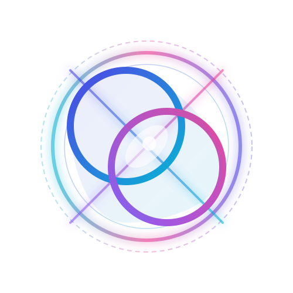
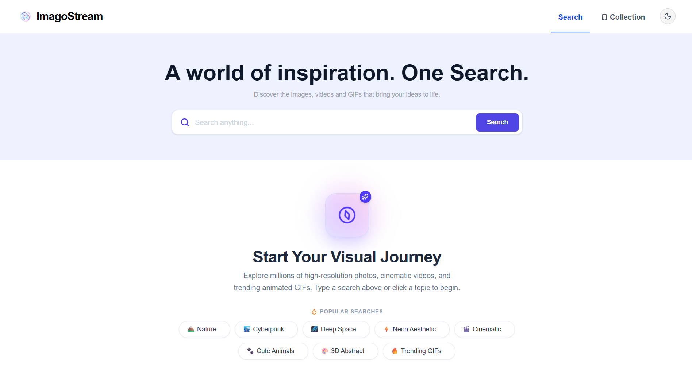
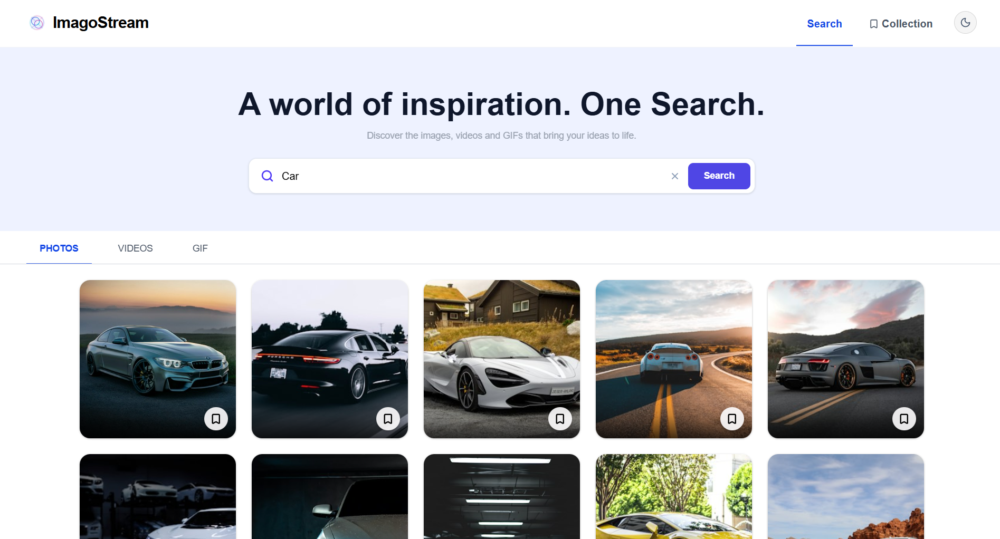
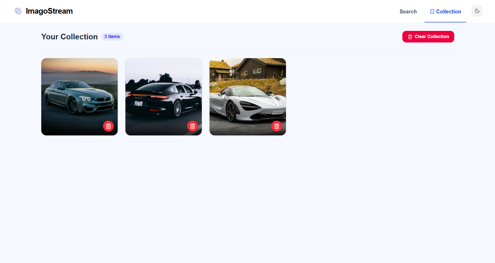
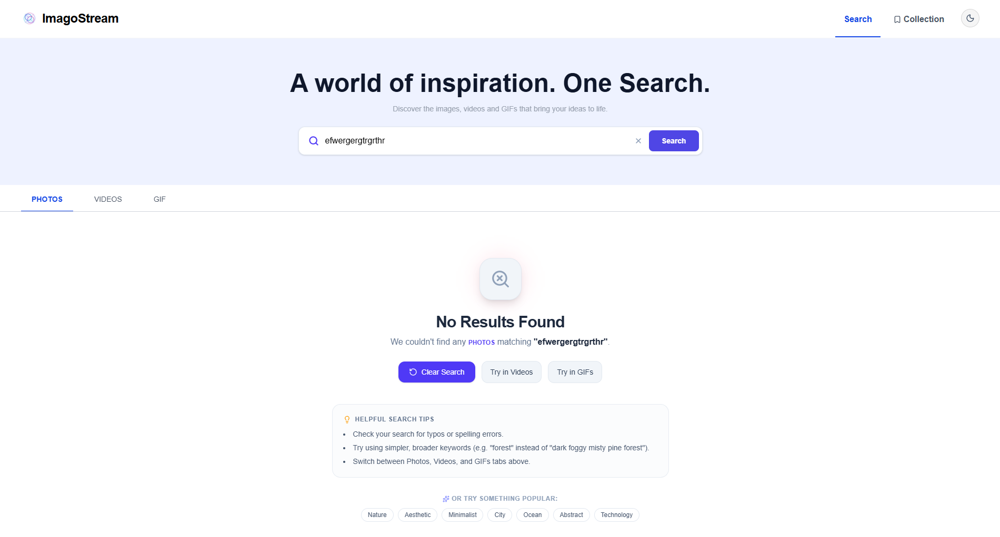

<h1 align="center">
  
  LensLoom
</h1>

<p align="center">
  A sleek, multi-media search app for discovering and collecting Photos, Videos & GIFs — all in one place.
</p>

<p align="center">
  <a href="https://imagostream.netlify.app/">
    
  </a>
  
  
  
</p>

---

## 📖 About

**LensLoom** is a modern, full-featured media discovery platform that lets users search for high-quality **Photos**, **Videos**, and **GIFs** from across the web using a unified interface. Powered by the **Unsplash**, **Pixabay**, and **GIPHY** APIs, LensLoom delivers instant results with a beautifully crafted UI featuring smooth dark/light mode transitions, skeleton loading states, a personal collection system, and **one-click media downloads** — all backed by Redux Toolkit for seamless state management. Recent updates bring significant performance optimisations for a noticeably smoother browsing experience.

---

## 🌐 Live Demo

🔗 **[https://imagostream.netlify.app/](https://imagostream.netlify.app/)**

---

## 📸 Screenshots

<table>
  <tr>
    <td align="center"><strong>Initial / Home UI</strong></td>
    <td align="center"><strong>Search Results</strong></td>
  </tr>
  <tr>
    <td></td>
    <td></td>
  </tr>
  <tr>
    <td align="center"><strong>Collection Page</strong></td>
    <td align="center"><strong>404 Not Found</strong></td>
  </tr>
  <tr>
    <td></td>
    <td></td>
  </tr>
</table>

---

## 🚀 Features

- 🔍 **Unified Media Search** — Search Photos, Videos, and GIFs from a single search bar with tabbed navigation
- 🌗 **Dark / Light Mode** — Smooth theme toggle with system-preference awareness and persistent state
- 💾 **Personal Collection** — Save and manage your favourite media items with Redux-powered persistence
- ⬇️ **Media Download** — Download any Photo, Video, or GIF directly to your device with a single click
- 📄 **Pagination** — Navigate through large result sets with a clean, accessible paginator
- ⚡ **Skeleton Loaders** — Shimmer loading skeletons for a polished, professional feel
- 🎯 **Empty & Error States** — Thoughtfully designed states for no results, errors, and empty collections
- 📱 **Fully Responsive** — Adaptive grid layouts optimised for mobile, tablet, and desktop screens
- 🔔 **Toast Notifications** — Non-intrusive feedback for collection actions via React Toastify
- 🗑️ **Clear Collection** — One-click bulk removal of all saved collection items
- 🚫 **404 Page** — Custom not-found page for unrecognised routes

---

## ⚡ Performance Improvements

The latest update brings several optimisations for a smoother, faster experience:

- **Optimised re-renders** — Components are wrapped with `React.memo` and selectors are refined to prevent unnecessary renders on state changes
- **Lazy image loading** — Media images use native `loading="lazy"` and are decoded asynchronously to avoid jank during scroll
- **Debounced interactions** — User input and rapid UI interactions are debounced to reduce redundant API calls and state updates
- **Efficient Redux selectors** — Memoised selectors ensure derived state is only recomputed when its inputs change
- **Smoother animations** — Transitions and hover effects are GPU-accelerated using `transform` and `opacity` properties for fluid 60fps rendering

---

## 🎨 Design System & Aesthetics

LensLoom is built with a cohesive design language centred around an **Indigo / Slate** colour palette with deep dark-mode support.

| Token | Light | Dark |
|---|---|---|
| **Background** | `#ffffff` / `indigo-50/50` | `#0b0f19` |
| **Text** | `slate-800` | `slate-100` |
| **Accent** | `indigo-600` | `indigo-400` |
| **Danger** | `rose-600` | `rose-500` |
| **Card Overlay** | `rgba(0,0,0,0.75)` gradient | Same |
| **Font** | Arial / Helvetica | Same |

**Key UI highlights:**
- Card hover overlays with gradient fade-to-bottom using `#bottom` gradient utility
- Shimmer `@keyframes` animation for skeleton placeholders
- Glassmorphic theme toggle button with `rgba` backgrounds and glow-on-hover in dark mode
- Smooth 300ms `transition-colors` across the entire app on theme switch
- Hidden scrollbar utility (`.scrollbar-none`) for clean overflow areas
- React Toastify dark-mode overrides for consistent toast styling

---

## 📁 Project Structure

```
LensLoom-App/
├── public/
│   ├── favicon.svg            # App favicon
│   └── icons.svg              # SVG icon sprite
├── src/
│   ├── API/
│   │   └── mediaApi.js        # Axios calls to Unsplash, Pixabay & GIPHY
│   ├── assets/
│   │   ├── favicon.svg        # Source favicon
│   │   ├── Initial-UI.png     # Screenshot — home/initial state
│   │   ├── Searched-UI.png    # Screenshot — search results
│   │   ├── Collection-UI.png  # Screenshot — collection page
│   │   └── NotFound-UI.png    # Screenshot — 404 page
│   ├── components/
│   │   ├── CollectionCard.jsx       # Individual saved-item card
│   │   ├── EmptyCollectionState.jsx # UI for empty collection
│   │   ├── EmptySearchState.jsx     # UI before first search
│   │   ├── ErrorState.jsx           # API error feedback
│   │   ├── LoadingSkeleton.jsx      # Shimmer skeleton grid
│   │   ├── Navbar.jsx               # Top navigation & theme toggle
│   │   ├── NoResultsState.jsx       # No search results feedback
│   │   ├── Pagination.jsx           # Page navigation controls
│   │   ├── ResultCard.jsx           # Single search result card
│   │   ├── ResultGrid.jsx           # Responsive media grid
│   │   ├── SearchBar.jsx            # Search input with submit
│   │   └── Tabs.jsx                 # Photos / Videos / GIFs tabs
│   ├── context/
│   │   ├── ThemeContext.js          # Theme context definition
│   │   ├── ThemeContext.jsx         # Theme provider component
│   │   └── useTheme.js              # useTheme custom hook
│   ├── pages/
│   │   ├── HomePage.jsx             # Main search & results page
│   │   └── CollectionPage.jsx       # Saved collection page
│   ├── redux/
│   │   ├── store.js                 # Redux store configuration
│   │   └── features/
│   │       ├── searchSlice.js       # Search state & actions
│   │       └── collectionSlice.js   # Collection state & actions
│   ├── App.jsx                # Root component & routes
│   ├── main.jsx               # React DOM entry point
│   └── index.css              # Global styles & design tokens
├── index.html                 # HTML shell
├── vite.config.js             # Vite configuration
├── eslint.config.js           # ESLint rules
├── package.json               # Dependencies & scripts
└── .env                       # API keys (not committed)
```

---

## ⚙️ Tech Stack

| Category | Technology |
|---|---|
| **Framework** | [React 19](https://react.dev/) |
| **Build Tool** | [Vite 8](https://vitejs.dev/) |
| **Styling** | [Tailwind CSS 4](https://tailwindcss.com/) |
| **State Management** | [Redux Toolkit](https://redux-toolkit.js.org/) + [React Redux](https://react-redux.js.org/) |
| **Routing** | [React Router DOM v7](https://reactrouter.com/) |
| **HTTP Client** | [Axios](https://axios-http.com/) |
| **Icons** | [Lucide React](https://lucide.dev/) |
| **Notifications** | [React Toastify](https://fkhadra.github.io/react-toastify/) |
| **Photos API** | [Unsplash API](https://unsplash.com/developers) |
| **Videos API** | [Pixabay API](https://pixabay.com/api/docs/) |
| **GIFs API** | [GIPHY API](https://developers.giphy.com/) |
| **Deployment** | [Netlify](https://netlify.com/) |

---

## 🛠️ Installation & Setup

### Prerequisites

- [Node.js](https://nodejs.org/) v18+
- npm v9+ (comes with Node)

### 1. Clone the repository

```bash
git clone https://github.com/rahulsingh2007/LensLoom.git
cd LensLoom-App
```

### 2. Install dependencies

```bash
npm install
```

### 3. Configure environment variables

Create a `.env` file in the root of the project and add your API keys:

```env
VITE_UNSPLASH_KEY=your_unsplash_access_key
VITE_PIXABAY_KEY=your_pixabay_api_key
VITE_GIPHY_KEY=your_giphy_api_key
```

> **Getting API Keys:**
> - 📷 **Unsplash** → [unsplash.com/developers](https://unsplash.com/developers)
> - 🎬 **Pixabay** → [pixabay.com/api/docs](https://pixabay.com/api/docs/)
> - 🎞️ **GIPHY** → [developers.giphy.com](https://developers.giphy.com/)

### 4. Start the development server

```bash
npm run dev
```

The app will be available at **[http://localhost:5173](http://localhost:5173)**.

---

## 🏃‍♂️ Available Scripts

| Script | Description |
|---|---|
| `npm run dev` | Start the local Vite dev server with HMR |
| `npm run build` | Compile and bundle the app for production |
| `npm run preview` | Preview the production build locally |
| `npm run lint` | Run ESLint across all source files |

---

## 📝 License

This project is open source and available under the [MIT License](LICENSE).

---

<p align="center">
  Made with ❤️ by <strong>Rahul Singh</strong>
</p>